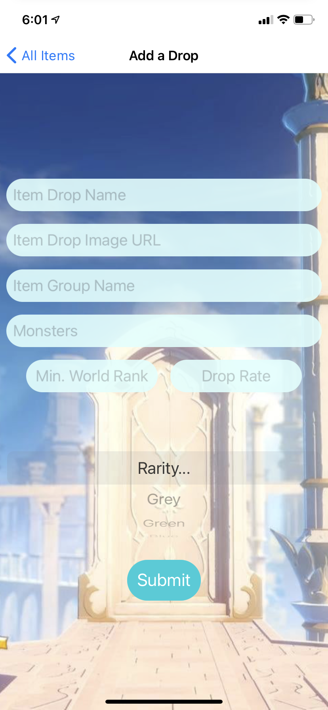
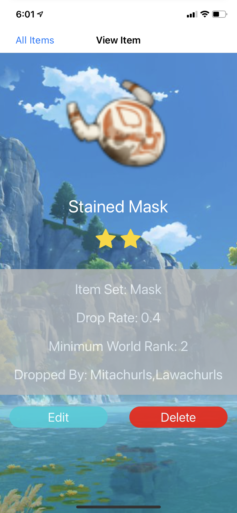
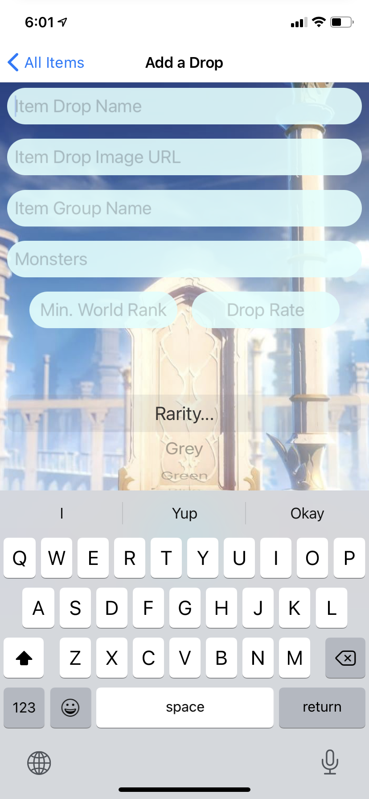
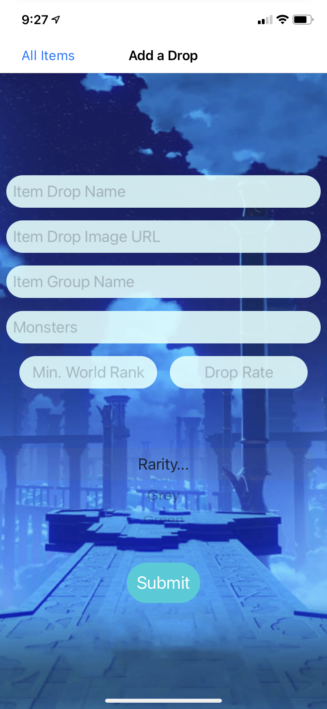
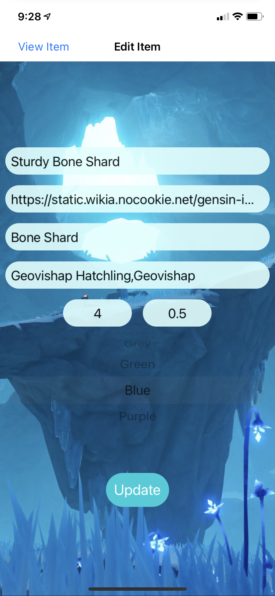

  

# GenDrops Frontend
The backend repository can be found at the following link: https://github.com/imranilyas/RevatureApps/tree/main/project0

## Description
**GenDrops** is a Genshin Impact-inspired application designed for players to view more information regarding a specific monster drop. The user is able to add, edit, view, or delete any monster drops to the database. All background images are from different sections of the game. If the user prefers a darker theme, they can toggle the switch located at the top right of the root screen and refresh the flatlist to see the background images change.     

## Device Support
The main branch along with every other branch excluding the *iOS* branch has the android build, whereas the iOS branch has the iOS build. The only notable difference is with the picker in the Add and Edit Screen but both are functional. Both devices are supported. Web, however, has not been tested and is not ready for view.

## Light Screens
All background images used on each screen were pulled from a variety of sources. In no way do I own these photos. The source can be found from the image address located in *src/styles/style.ts*

 
 
 
 

On both the Add and Edit Screen, when you press on any of the input fields, all the fields shift up so that everything is accessible while the keyboard is up.

 

## Dark Screens
The dark theme can be accessed through toggling the switch at the top of the root screen and refreshing the flatlist.

 
 
 
 

## Form Validation
On both the Add and Edit Screens, if the user tries to submit / update an item drop without filling out all the fields, the request does not go through and a toast message will appear from the top of the screen informing the user that the request is invalid. Upon a successful request, the user is notified through a toast message displaying what they successfully managed to accomplish.

For deleting an item, the user is first alerted that they are trying to delete an item. If the user confirms the request, then an item is deleted. Otherwise, the delete request is not sent through. This is to protect the user from deleting items accidentally.

## Future Implementations
* Refactor styling to a global stylesheet so that background colors and text colors can be changed upon toggling the switch.
  * Currently, only the images change.
* The background themes in the Add, Edit, and View screen will change upon toggling the switch. However, the root screen will not change unless you refresh the flatlist. To fix that, the switch would likely need to be refactored so that a refresh is triggered upon toggling the switch.
